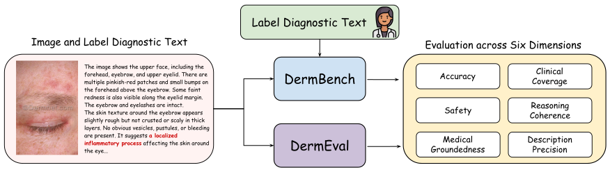

# DermBench



DermBench is the reference-based benchmark component from **Towards Trustworthy Dermatology MLLMs: A Benchmark and Multimodal Evaluator for Diagnostic Narratives**. It evaluates dermatology image-to-diagnostic-narrative outputs with a fixed candidate-generation prompt, clinician-certified reference CoT texts, and six clinical scoring dimensions.

This repository contains the DermBench text release and minimal runnable evaluation code. It does **not** redistribute DermNet images.

## Contents

- `data/cot/`: 4000 clinician-certified dermatology diagnostic CoT/reference texts.
- `data/manifest/dermbench_test.jsonl`: mapping from each CoT text to the corresponding DermNet test-set image path.
- `prompts/`: the standardized candidate-generation and DermBench judge prompts.
- `scripts/`: minimal validation, candidate generation, scoring, and score summarization scripts.
- `configs/models.json`: metric order, reported benchmark models, and judge-model defaults.
- `dermeval/`: placeholder for the DermEval component.

The CoT files were prepared from the source text tree `Dermnet2/step4_txt/test`. Candidate model outputs, result files, old API scripts, API keys, and proxy endpoints are intentionally excluded.

## Data Mapping

Each JSONL row has this shape:

```json
{
  "id": "dermbench_0001",
  "source": "DermNet test set",
  "split": "test",
  "category": "Acne and Rosacea Photos",
  "diagnosis": "PerioralDermEye",
  "dermnet_image_path": "Acne and Rosacea Photos/07PerioralDermEye.jpg",
  "cot": "data/cot/Acne and Rosacea Photos/07PerioralDermEye.jpg.txt",
  "cot_sha256": "..."
}
```

The corresponding image is expected at:

```text
$DERMNET_TEST_ROOT/<dermnet_image_path>
```

For example:

```text
$DERMNET_TEST_ROOT/Acne and Rosacea Photos/07PerioralDermEye.jpg
```

DermNet images are external to this repository. Obtain and use them only under the applicable DermNet terms and any separate research agreement that applies to your project.

Official DermNet links:

- DermNet home: https://dermnetnz.org/
- DermNet image library: https://dermnetnz.org/images
- DermNet image licence: https://dermnetnz.org/image-licence
- DermNet website terms: https://dermnetnz.org/terms

## Scoring Metrics

DermBench scores each candidate narrative on six 0-5 dimensions:

- Accuracy
- Safety
- Medical Groundedness
- Clinical Coverage
- Reasoning Coherence
- Description Precision

The metric order is fixed in `configs/models.json` and `dermbench/scoring.py`.

## Setup

```bash
conda env create -f environment.yml
conda activate dermbench
```

Or with pip:

```bash
python -m venv .venv
source .venv/bin/activate
pip install -r requirements.txt
```

Validate the text-only release:

```bash
python scripts/validate_release.py --check-sha
```

Validate mapping against a local DermNet test image root:

```bash
export DERMNET_TEST_ROOT=/your/dermnet/test/root
python scripts/validate_release.py --image-root "$DERMNET_TEST_ROOT"
```

## Minimal Evaluation Example

Generate candidate narratives with the standard OpenAI API:

```bash
export OPENAI_API_KEY=...
python scripts/generate_candidates_openai.py \
  --image-root "$DERMNET_TEST_ROOT" \
  --model gpt-4o-mini \
  --limit 10 \
  --output outputs/gpt4o_mini_candidates.jsonl
```

Score candidates with the DermBench reference-based judge:

```bash
export DEEPSEEK_API_KEY=...
python scripts/score_with_deepseek.py \
  --candidates outputs/gpt4o_mini_candidates.jsonl \
  --output outputs/gpt4o_mini_scores.jsonl
```

Summarize mean scores:

```bash
python scripts/summarize_scores.py --scores outputs/gpt4o_mini_scores.jsonl
```

The paper reports DeepSeek-R1 as the DermBench judge. The example uses DeepSeek's official OpenAI-compatible endpoint by default (`https://api.deepseek.com`) and the environment variable `DEEPSEEK_API_KEY`. No API key is stored in the repository.

## DermEval

DermEval is the reference-free evaluator described in the paper. Its release is intentionally left as a placeholder in this repository while the DermBench text benchmark is prepared.

## Citation

```bibtex
@article{shen2025towards,
  title={Towards Trustworthy Dermatology MLLMs: A Benchmark and Multimodal Evaluator for Diagnostic Narratives},
  author={Shen, Yuhao and Qian, Jiahe and Zhang, Shuping and Chen, Zhangtianyi and Lu, Tao and Zhou, Juexiao},
  journal={arXiv preprint arXiv:2511.09195},
  year={2025}
}
```
